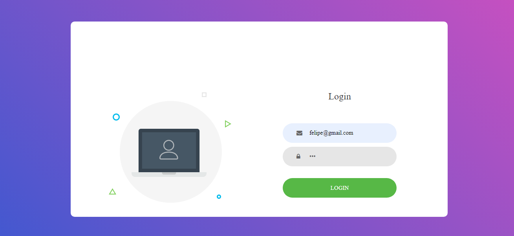
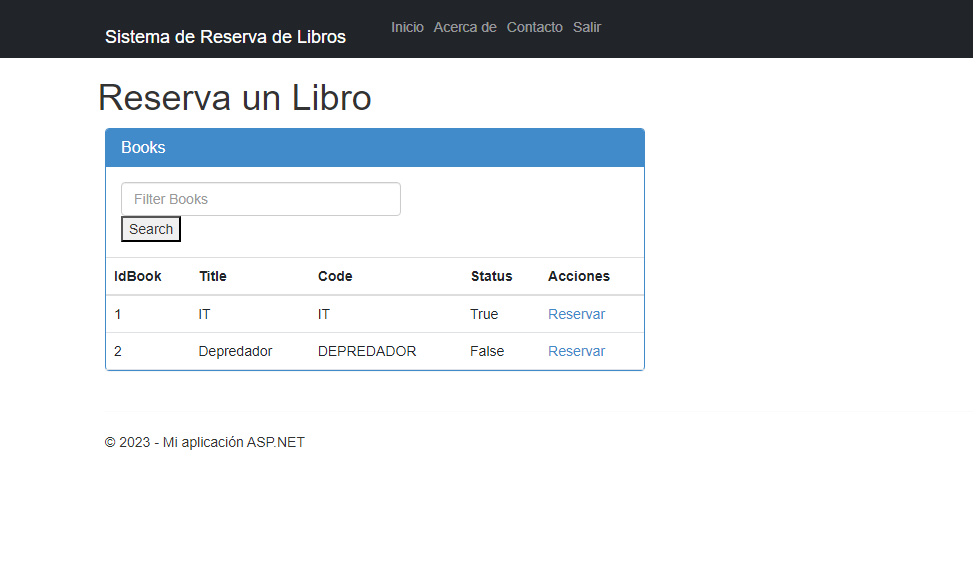

# Sistema para Reservar Libros

Para poder logearse usar:
- Email: felipe@gmail
- Password: 123

> **Nota:** Por el tiempo, el avance radica en los módulos:
> - SQL Server (crear base de datos, tabla, store procedures)
> - Servicio WCF (Para login, busqueda y listado de libros) 
> - ASP. NET (Login, Index de libro y filtrado, [en proceso de registrar reservacion])
  
## Capturas

